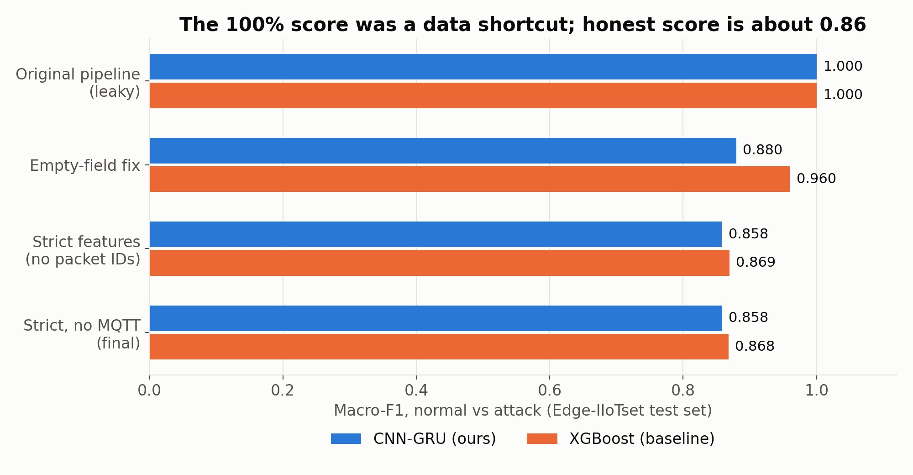
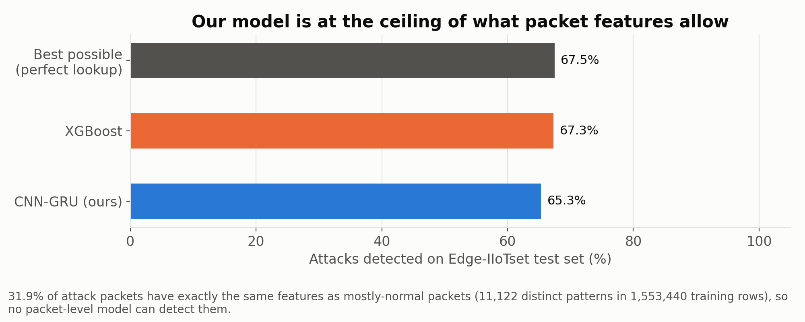
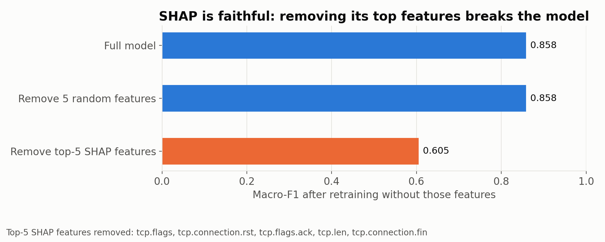
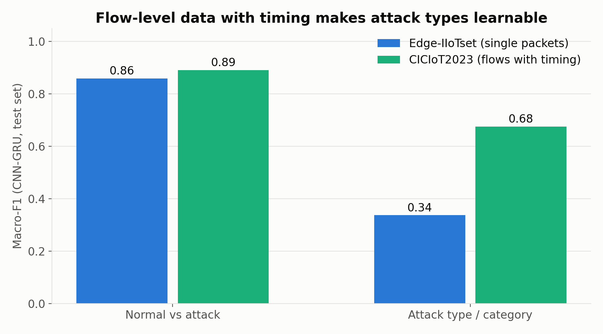
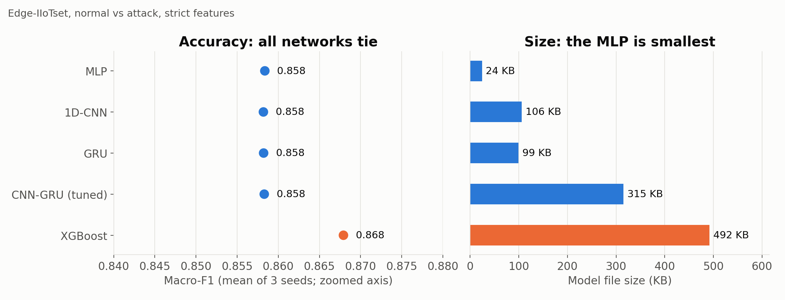

# Explainable, Lightweight Intrusion Detection for IoT Networks

A deep-learning **intrusion detection system (IDS)** for IoT networks that is **accurate**,
**explainable** (it shows *why* it raised an alarm) and **small enough for an IoT gateway**.

The model is a hybrid **CNN-GRU** with **SHAP** explanations, tested on two public IoT datasets:
**Edge-IIoTset** (2.2 million network packets) and **CICIoT2023** (network flows with timing data).

> **In one sentence:** the "100% accuracy" this dataset usually gives comes from hidden shortcuts
> in the data. We found and removed them, measured how good a model *can* honestly be, proved our
> explanations are faithful, and showed which kind of data is needed to recognise attack types.

---

## 📌 Contents

1. [The project in 1 minute](#-the-project-in-1-minute)
2. [Key results](#-key-results)
3. [How we got there](#-how-we-got-there)
4. [Quick start](#-quick-start)
5. [Live demo](#-live-demo)
6. [Re-run the experiments](#-re-run-the-experiments)
7. [Project structure](#-project-structure)
8. [Detailed results](#-detailed-results)
9. [Limitations and next steps](#-limitations-and-next-steps)
10. [Documentation guide](#-documentation-guide)
11. [Datasets and credits](#-datasets-and-credits)

---

## ⏱ The project in 1 minute

| | |
|---|---|
| **Problem** | IoT devices (sensors, cameras, meters) are easy to attack and too weak to run heavy security software. |
| **Goal** | An IDS that is **accurate**, **explainable** and **lightweight**. |
| **What went wrong first** | Every model scored **100%**, which was too good to be true. |
| **Why** | The dataset writes empty fields as `"0"` in normal traffic but `"0.0"` in attack traffic. Models read the formatting, not the attack. |
| **What we did** | Removed this and other shortcuts, added automatic checks, retrained everything honestly. |
| **Honest result** | **0.858 Macro-F1, 90% accuracy, 0.7% false alarms** (Normal vs Attack). |
| **Explainable?** | Yes, and **proven**: removing the features SHAP points to drops the score from 0.86 to 0.60. |
| **Lightweight?** | Yes: **159 KB** model, about **6 ms** per packet on one CPU core. |
| **Second dataset** | CICIoT2023 (with timing data): **0.89–0.92** Macro-F1 for detection, **0.68–0.75** for attack categories. |

---

## 📊 Key results

**1. The 100% was fake; the honest score is about 0.86**



**2. Our model is at the limit of what this data allows.** About a third of attack packets look
*exactly* like normal packets, so even a perfect model could catch only 67.5% of attacks. Ours
catches 65.3%.



**3. The explanations are faithful.** Removing the 5 features SHAP ranks highest breaks the model;
removing 5 random features changes nothing.



**4. Data with timing makes attack types learnable** (CICIoT2023 vs Edge-IIoTset).



**5. Honest comparison: simpler networks do just as well on per-packet data** (all reach 0.858;
the MLP is the smallest at 24 KB).



---

## 🧭 How we got there

```
Raw packets ──► Find shortcuts ──► Remove them ──► Train on GPU ──► Explain (SHAP) ──► Prove SHAP ──► Shrink for edge
 (2.2M rows)    "0" vs "0.0",      clean, strict    CNN-GRU +       which features   remove top      FP16: 159 KB,
                packet IDs, MQTT   feature set      baselines       matter           features         6 ms / packet
```

| Step | What we did | Why |
|---|---|---|
| 1. Audit | Compared how each class writes empty fields | The 100% score needed an explanation |
| 2. Fix | Wrote `"0"` and `"0.0"` the same way; removed 7 per-packet ID fields and all MQTT fields | They identify the *recording*, not the attack |
| 3. Check | Automatic "shortcut scan" after every preprocessing run | Catches any single feature that gives the answer away |
| 4. Train | CNN-GRU on the GPU, tuned with Optuna, 3 random seeds | Results must be stable, not lucky |
| 5. Compare | Same data for MLP, 1D-CNN, GRU and XGBoost | Is the hybrid really needed? |
| 6. Explain | SHAP, then retrain without the top SHAP features | Prove the explanations are true |
| 7. Deploy | CPU benchmark of FP32 / FP16 / INT8 versions | Show it fits an IoT gateway |
| 8. Second dataset | Same pipeline on CICIoT2023; found and removed a second shortcut (`packet_count`) | Test whether the limit is the model or the data |

---

## 🚀 Quick start

**Requirements:** Python 3.10+ (tested on 3.13), Windows/Linux/macOS. A CUDA GPU is optional but
much faster (tested on an RTX 4060 Laptop GPU).

```bash
# 1. Get the code
git clone https://github.com/TAPAN-2835/IoT-IDS.git
cd IoT-IDS

# 2. Create an environment and install packages
python -m venv .venv
.venv\Scripts\activate                 # Linux/macOS: source .venv/bin/activate
pip install -r requirements.txt
pip install -r dashboard/requirements_dashboard.txt   # only for the web dashboard / live demo

# 3. Download the main dataset (Edge-IIoTset, about 1.2 GB) into data/raw/
python download_dataset.py

# 4. Prepare the data (cleaning + shortcut check) and train the baselines
python run_clean_baselines.py --policy strict_no_mqtt --stage binary
```

> For GPU training, install the CUDA build of PyTorch from <https://pytorch.org>. Everything also
> runs on the CPU, just more slowly.

---

## 🎬 Live demo

The web dashboard has a live demo: the final model classifies **real test packets it has never
seen** and shows **why**, using SHAP.

```bash
python -m uvicorn dashboard.api:app --port 8000
```

Open **<http://127.0.0.1:8000/#predict-demo>** and click *Random attack packet*.

You will see the verdict (ATTACK / NORMAL), the attack probability, whether it was correct, the
time taken on the CPU, and the top reasons (for example `tcp.flags`, `tcp.len`).

* The model loads in the background when the server starts (about 30 seconds).
* The final model must be trained first (`run_tune_cnn_gru.py`) and `data/processed/` must hold
  the matching data; otherwise the page tells you which command to run.

---

## 🔁 Re-run the experiments

Each command saves its results to `results/`. Watch progress live with
`python watch_dashboard.py` in a second terminal.

| Command | What it does | Time* |
|---|---|---|
| `python audit_shortcuts.py --raw` | Shows the `"0"` vs `"0.0"` shortcut in the raw data | 1 min |
| `python run_clean_baselines.py --policy strict_no_mqtt --stage binary` | Clean data + shortcut scan + XGBoost and CNN-GRU | 6 min |
| `python run_tune_cnn_gru.py --trials 20 --prefix F` | Tunes the CNN-GRU, then trains the best one with 3 seeds | 45 min |
| `python run_final_studies.py` | Model comparison, SHAP, SHAP fidelity test, edge benchmark | 30 min |
| `python run_operating_points.py` | Detection vs false-alarm trade-off | 1 min |
| `python audit_ceiling.py` | Measures the best detection rate any model could reach | 1 min |
| `python run_ciciot.py --policy strict` | Second dataset (downloads 718 MB once) + 5 experiments | 10 min |
| `python make_figures.py` | Rebuilds the charts in `results/figures/` | 10 s |

\* On an RTX 4060 laptop, plugged in.

**Tips for long runs on a laptop**

* `python run_queue.py "script1.py --args" "script2.py"` runs several commands in a row and keeps
  Windows from going to sleep in between. Keep the lid open and the charger connected (on battery
  the GPU is slowed down).
* The pipeline uses little RAM (about 3.4 GB at peak): the CSV is streamed and training data is
  kept on the GPU.

**Built-in safety checks**

* Every processed dataset gets a *fingerprint*. Training and SHAP refuse to run on data that does
  not match the model (this prevents explaining a model with the wrong inputs).
* A shortcut scan runs after every preprocessing step.
* Thresholds and tuning use the validation set only; the test set is used once, for reporting.

---

## 🗂 Project structure

```
IoT-IDS/
├── src/                      Core library
│   ├── config.py             Paths, seeds, training settings, shortcut-fix switch
│   ├── data_loader.py        Low-RAM streaming CSV loader
│   ├── preprocessing.py      Cleaning, "0"/"0.0" fix, encoding, data fingerprint
│   ├── models.py             CNN-GRU, 1D-CNN, GRU, MLP
│   ├── training.py           GPU training, class weights, threshold tuning
│   ├── train.py              XGBoost (GPU) and Random Forest baselines
│   ├── explainability.py     SHAP with the wrong-data guard
│   ├── ciciot.py             CICIoT2023 sampling and cleaning
│   └── run_status.py         Progress file for the terminal dashboard
│
├── audit_shortcuts.py        Shortcut evidence and scans
├── audit_ceiling.py          Best possible detection rate
├── run_clean_baselines.py    Main experiment runner (feature policies, loss study)
├── run_tune_cnn_gru.py       Optuna tuning + final 3-seed runs
├── run_final_studies.py      Model comparison, SHAP, fidelity test, edge benchmark
├── run_edge_benchmark.py     CPU size/speed benchmark (FP32 / FP16 / INT8 / XGBoost)
├── run_operating_points.py   Detection vs false-alarm trade-off
├── run_ciciot.py             Second dataset (CICIoT2023)
├── run_queue.py              Run several commands without the laptop sleeping
├── make_figures.py           Presentation charts
├── watch_dashboard.py        Live terminal dashboard
│
├── dashboard/                Web dashboard + live prediction demo (FastAPI)
├── results/
│   ├── experiment_registry.csv   One row per experiment (all metrics)
│   ├── experiments/<id>/         Per-experiment reports, confusion matrices, SHAP plots
│   ├── figures/                  Charts used in this README and the slides
│   └── audit/                    Shortcut evidence, feature policies, ceiling
├── docs/                     Results, Q&A and study material (see below)
└── tests/                    Unit tests (python -m pytest tests)
```

Scripts named `run_phase*.py`, `run_E0*.py`, `run_remaining_pipeline.py` and `run_shap_fix.py`
produced the **original, leaky** experiments (E01–E08). They are kept for history; do not use
their results.

---

## 📋 Detailed results

All numbers are on the held-out test set. Full tables: [docs/FINAL_RESULTS.md](docs/FINAL_RESULTS.md).

<details>
<summary><b>Edge-IIoTset: Normal vs Attack (final setting)</b></summary>

| Model | Macro-F1 | Accuracy | False alarms | Attacks detected |
|---|---|---|---|---|
| Original pipeline (leaky, fake) | 1.000 | 100% | 0% | 100% |
| **CNN-GRU (ours, tuned)** | **0.858** | **90.0%** | **0.7%** | **65.3%** |
| XGBoost | 0.868 | 90.7% | 0.6% | 67.3% |
| Best possible (perfect lookup) | - | - | 0.5% | 67.5% |

* Same score with or without MQTT features (0.8575 vs 0.8579), and over 3 seeds
  (0.8584 / 0.8583 / 0.8582).
* Optuna tuning (20 trials) gives no gain: the data, not the model, sets the limit.
* Accepting 6.6% false alarms raises detection to 73.3%.
</details>

<details>
<summary><b>Model comparison (3 seeds each)</b></summary>

| Model | Macro-F1 | Parameters | Size |
|---|---|---|---|
| MLP | 0.858 | 5,441 | 24 KB |
| 1D-CNN | 0.858 | 25,857 | 106 KB |
| GRU | 0.858 | 24,577 | 99 KB |
| CNN-GRU (tuned) | 0.858 | 79,169 | 315 KB |
| XGBoost | 0.868 | 226 trees | 492 KB |
</details>

<details>
<summary><b>Explainability (SHAP) and the fidelity test</b></summary>

* Top features of the final model: `tcp.flags`, `tcp.connection.rst`, `tcp.flags.ack`, `tcp.len`,
  `tcp.connection.fin`: real TCP behaviour.
* Retrained without those 5 features: Macro-F1 **0.858 → 0.605**.
* Retrained without 5 random features: **0.858 → 0.858**.
</details>

<details>
<summary><b>Edge deployment (one CPU thread)</b></summary>

| Version | Macro-F1 | Size | Time per packet |
|---|---|---|---|
| CNN-GRU, full precision | 0.858 | 315 KB | 6.4 ms |
| **CNN-GRU, half precision (FP16)** | **0.858** | **159 KB** | 6.5 ms |
| CNN-GRU, INT8 compressed | 0.782 | 88 KB | 13.3 ms |
| XGBoost | 0.868 | 492 KB | 0.8 ms |

FP16 halves the size with no loss; full INT8 compression hurts accuracy.
</details>

<details>
<summary><b>Attack-type classification and the loss study</b></summary>

On Edge-IIoTset (14 attacks + Normal) per-packet data is not enough: XGBoost 0.429, CNN-GRU
0.337 Macro-F1. Floods and scans are about packet *rate*, which one packet cannot show.

Loss functions compared over 3 seeds: square-root class weights **0.337** > focal 0.254 >
cross-entropy 0.238.
</details>

<details>
<summary><b>CICIoT2023 (flow data with timing)</b></summary>

1.41M-row sample, 87,417 duplicates removed before splitting, `source_file` and the
`packet_count` window-size shortcut removed.

| Task | Model | Macro-F1 | Notes |
|---|---|---|---|
| Benign vs Attack | XGBoost | **0.917** | detects 93.4%, 8.4% false alarms |
| Benign vs Attack | CNN-GRU | **0.890** | detects 90.4%, 9.6% false alarms |
| 8 attack categories | XGBoost | **0.752** | |
| 8 attack categories | CNN-GRU | **0.675** | square-root class weights |

At ≤ 1% false alarms the CNN-GRU still detects 82.3% of attacks. SHAP ranks `rate` (packets per
second) among its top features.
</details>

---

## 🔭 Limitations and next steps

**Limitations (stated honestly)**

* On per-packet features the CNN-GRU is **not better** than a simple MLP or XGBoost.
* About a third of Edge-IIoTset attack packets are **indistinguishable** from normal ones.
* The GRU sees **no real time dimension**: each packet is processed alone.
* Rare attack types (Web, BruteForce) are still weak.
* One random train/test split per dataset; no cross-dataset test yet.

**Next steps**

| Gap | Plan |
|---|---|
| GRU has no time information | Feed it **sequences** of consecutive flow windows so it can learn how traffic changes |
| Missed attacks | Use flow-level data as the main setting; pick thresholds by acceptable false-alarm rate |
| Rare attack types | Square-root class weights (already helps) + targeted oversampling |
| Generalisation | Train on one dataset, test on the other |
| Real deployment | Run the 159 KB FP16 model on a Raspberry-Pi-class device |

---

## 📚 Documentation guide

| If you want… | Read |
|---|---|
| All final numbers in one place | [docs/FINAL_RESULTS.md](docs/FINAL_RESULTS.md) |
| Answers to hard viva questions | [docs/VIVA_QA.md](docs/VIVA_QA.md) |
| A friendly, non-technical explanation | [docs/FRIENDLY_PROJECT_EXPLANATION.md](docs/FRIENDLY_PROJECT_EXPLANATION.md) |
| The presentation script (with timer) | [faculty_presentation_script.html](faculty_presentation_script.html) |
| A full study guide (also as PDF) | [project_mastery_study_guide.html](project_mastery_study_guide.html) |
| Deep technical detail for mentors | [MENTOR_DEEP_DIVE_PROJECT_STATUS.md](MENTOR_DEEP_DIVE_PROJECT_STATUS.md) |
| How the shortcut was found and fixed | [docs/LEAKAGE_FIX_AND_CLEAN_BASELINES.md](docs/LEAKAGE_FIX_AND_CLEAN_BASELINES.md) |

Older documents in `docs/` (E01–E05, Phase 2) describe the earlier, leaky stage and carry a
correction note at the top.

---

## 🙏 Datasets and credits

* **Edge-IIoTset:** M. A. Ferrag et al., *"Edge-IIoTset: A New Comprehensive Realistic Cyber
  Security Dataset of IoT and IIoT Applications for Centralized and Federated Learning"*, IEEE
  Access, 2022. Downloaded from Kaggle (`mohamedamineferrag/edgeiiotset-cyber-security-dataset-of-iot-iiot`);
  file used: `DNN-EdgeIIoT-dataset.csv`.
* **CICIoT2023:** E. C. P. Neto et al., *"CICIoT2023: A real-time dataset and benchmark for
  large-scale attacks in IoT environment"*, Sensors, 2023. Used through the Kaggle mirror
  `dhoogla/ciciotdataset2023` (CC BY-NC-SA 4.0). It is downloaded to the user's cache, not stored
  in this repository.

Datasets and trained model weights are not committed (see `.gitignore`); every result can be
regenerated with the commands above.

Minor project, 2026. Contributors: see the commit history.

---

## 🔬 Reproducing the paper

To completely reproduce the results, figures, and numbers used in the paper:
1. Ensure your environment matches the pinned versions in `requirements-lock.txt` (Python 3.13, PyTorch 2.1.1+cu121, XGBoost 3.0.5, etc.).
2. Run the reproducibility master script from the root directory:
   ```bash
   python reproduce_paper.py
   ```
   This script will automatically run the claim verifications (Task 1A), execute all replication and baseline experiments (Task 1B), generate the figures, and build the `paper/numbers.tex` macro file required to compile the LaTeX paper.
