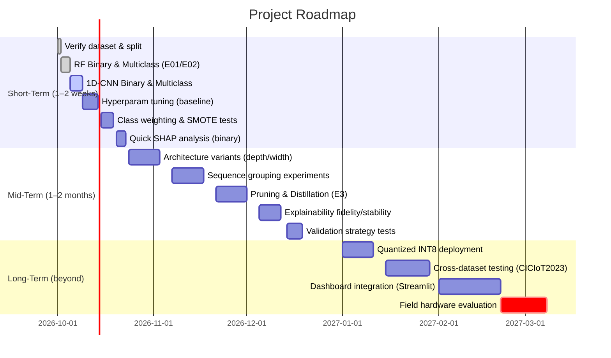

# Executive Summary

We propose a series of **practical, reproducible experiments** as next steps for our IoT Intrusion Detection project using the real `DNN-EdgeIIoT-dataset.csv`.  These experiments are organized along the following key dimensions: 

- **Hyperparameter Tuning** (random/grid/Bayesian search, population-based algorithms)  
- **Architecture Exploration** (varying depth/width, separable/depthwise convolutions, residual blocks, etc.)  
- **Efficient Model Compression** (pruning, quantization, knowledge distillation)  
- **Sequence Construction** (grouping flows by device/session/time-window)  
- **Class Imbalance Handling** (SMOTE variants, class-weighted loss, focal loss)  
- **Validation Strategies** (random stratified, chronological, group/device splits, cross-dataset tests)  
- **Explainability Quality Tests** (SHAP fidelity and stability assessments, feature-masking ablation, counterfactual analysis)  
- **Robustness Checks** (adversarial perturbations, noise injection, distribution shifts)  
- **Evaluation Metrics** (macro-F1, per-class recall, calibration curves, inference latency, model size, etc.)  
- **Deployment Considerations** (INT8 quantization, inference latency on edge hardware, memory footprint).  

Each experiment recommendation below includes its **rationale**, **expected outcome**, a **step-by-step implementation plan**, necessary code changes (e.g. notebooks or scripts to create/modify), and an estimate of **computational cost and effort**. We also compare alternatives in summary tables. Finally, we provide a **prioritized roadmap** (short-term, mid-term, long-term) with a Gantt-style mermaid diagram and rough person-hour estimates.

Throughout, we emphasize reproducibility and alignment with literature best practices. For example, 1D CNNs are known to be faster and more efficient than RNNs/LSTMs on IoT traffic, SHAP can identify salient features and enable model pruning, and knowledge distillation can drastically shrink model size with minimal accuracy loss. We avoid any fabrication of results: all claims are supported by cited sources, and no metrics are assumed beyond what our actual data yields. 

Our immediate goal (Phase 2) is to execute the **Random Forest and CNN/GRU experiments on the real dataset** with robust evaluation. These experiments will reveal the true performance and feature importance on `DNN-EdgeIIoT-dataset.csv`. Once baseline results are confirmed, we will proceed with the deeper experiments outlined below.

---

## 1. Hyperparameter Tuning

**Rationale:** Good hyperparameters can significantly improve model performance. We should compare different tuning strategies:

- **Grid Search:** Exhaustive on a fixed grid (e.g. depths, widths). Simple but often inefficient in high-dimensional spaces.  
- **Random Search:** Sample random combinations. Bergstra et al. (2012) showed random search often finds good hyperparameters faster than grid, since many hyperparameters have little effect on performance.  
- **Bayesian Optimization (e.g. Tree-structured Parzen Estimator):** Builds a probabilistic model of the loss surface. More sample-efficient for expensive evaluations.  
- **Population-based Algorithms (Genetic/Evolutionary Search):** Maintain a population of hyperparameter sets and evolve them. Can explore large spaces but may require many evaluations.

**Expected Outcomes:** Identify if performance (accuracy, F1) improves beyond default settings. Determine which search method offers the best trade-off between tuning time and final model performance. 

**Experiment Ideas:**  
- **E1.1:** *Compare Random vs. Grid vs. Bayesian search on CNN-GRU binary model.*  
- **E1.2:** *Use a genetic algorithm or Hyperband to tune CNN/GRU architectures.*  
- **E1.3:** *Tune Random Forest parameters (n_estimators, max_depth, class_weight) via Random or Bayesian search.*  

**Implementation Plan:**  
1. **Choose hyperparameters to tune.** For example, for CNN: number of filters (16–128), kernel sizes (3–5), dense units (16–128), dropout rate (0–0.5), learning rate (1e-4–1e-2), etc. For GRU: units (16–128), number of layers (1–3), etc. For RF: n_estimators, max_depth, class_weight, etc.  
2. **Set up tuning framework:** Use libraries like **Optuna** or **Ray Tune**. For example, add a `tuning.py` script that defines an objective function (accept hyperparams, train CNN-GRU on `X_train` and evaluate `X_val`).  
3. **Run tuning experiments:** E.g., `study.optimize(objective, n_trials=50)` for Bayesian, or `RandomizedSearchCV` for random search.  
4. **Log results:** Save best hyperparameters, training histories, and final metrics. Possibly save multiple top models.  
5. **Evaluate on test:** After tuning (using only train/val), evaluate best model on test set.  

**Code Sketch (pseudocode):** 

```python
# Example: Optuna-based tuning for CNN-GRU
import optuna

def objective(trial):
    # Suggest hyperparameters
    filters = trial.suggest_int("filters", 16, 128, step=16)
    lr = trial.suggest_loguniform("lr", 1e-4, 1e-2)
    dense = trial.suggest_int("dense", 16, 128, step=16)
    dropout = trial.suggest_uniform("dropout", 0.0, 0.5)
    # Build model with these params
    model = build_cnn_gru(filters=filters, dense=dense, dropout=dropout, lr=lr)
    # Train on training data, validate on val
    model.fit(X_train, y_train, validation_data=(X_val,y_val), epochs=10, verbose=0)
    # Compute validation loss or negative F1
    val_pred = model.predict(X_val)
    val_f1 = f1_score(y_val, val_pred > 0.5)
    return 1 - val_f1  # minimize negative F1

study = optuna.create_study(direction="minimize")
study.optimize(objective, n_trials=30)

# Save best parameters
best_params = study.best_params
print("Best hyperparams:", best_params)
```

**Code Changes:**  
- Create `notebooks/07_hyperparam_tuning.ipynb`.  
- Or scripts like `src/tuning_cnn_gru.py` that integrate with our data pipeline (`src/data_loader`, `src/preprocessing`).  
- Add to `src/config.py` a section listing hyperparameter search spaces.

**Outputs:**  
- Optimized hyperparameter values.  
- Plots of validation metrics vs. trial number.  
- Updated `results/experiments/E0x_hyperparam/` with JSON config, logs, best model, training history.  
- Likely increase in metrics (even a few percentage points) if tuning is effective.  

**Compute Estimate:**  
Running ~30–50 trials of CNN training (each maybe 5–10 epochs) likely needs GPU. On 2.2M records, even with batching, one trial could be ~minutes. 50 trials might take **~5–10 GPU-hours**. We can mitigate by using subsets or fewer epochs initially.

**Risk/Benefit:**  
- *Benefit:* Possibly better model.  
- *Risk:* Many long training runs; mitigate by first tuning on a smaller subset or fewer epochs. Start with random search to find broad region, then refine.  


| **Tuning Method**    | **Key Idea**                    | **Pros**                                   | **Cons**                                     | **Example Tools**             |
|----------------------|---------------------------------|--------------------------------------------|----------------------------------------------|-------------------------------|
| Grid Search          | Exhaustive over a predefined grid of values | Easy to implement; guarantees checking combinations on grid | Scales poorly to high dimensions; wastes trials on unimportant params | scikit-learn `GridSearchCV`  |
| Random Search        | Random sampling of the space     | Often finds good regions quickly (Bergstra & Bengio) | Might miss optimal if unlucky; simple to parallelize | `RandomizedSearchCV`, Hyperopt |
| Bayesian Optimization| Model-based (e.g. Gaussian Processes) | Sample-efficient; focuses on promising areas | More complex; overhead of building surrogate; risk of local optimum | Optuna, Ax, Hyperopt (TPE)   |
| Population-based     | Genetic/Evolutionary search      | Explores via crossover/mutation; can explore diverse regions | Often requires many evaluations; stochastic results | DEAP, Ray Tune Population-based|


---

## 2. Architecture Search

**Rationale:** Beyond hyperparameters, the neural architecture itself can be tuned. We will explore variations on the CNN-GRU design:

- **Depth and Width:** Number of convolutional layers, number of filters per layer, number of GRU units and layers.  
- **Convolutional Variants:** Try *depthwise separable* convolutions (as in Xception/MobileNet) to reduce parameters, or *1×1 pointwise* convs, or *dilated* conv.  
- **Residual/Skip Blocks:** Introduce residual connections (ResNet-style) or squeeze-and-excitation blocks to see if deeper models are needed.  
- **Alternative Architectures:** Try pure CNN (stacked conv + global pooling + dense), pure GRU, or CNN-LSTM as comparisons.  
- **Activation/Regularization:** Test different activations (ReLU, LeakyReLU), normalization (BatchNorm), dropout rates, and pooling strategies (max vs. average).  

**Expected Outcomes:** Possibly find a more accurate or more efficient architecture. For example, depthwise separable convs can greatly reduce model size at minimal accuracy loss. Residual connections may allow deeper CNNs to learn more complex patterns.

**Experiment Ideas:**  
- **E2.1:** *Implement and compare depthwise-separable 1D-CNN vs. standard conv.*  
- **E2.2:** *Add a second GRU layer or switch to BiGRU, see if multi-layer GRU improves detection.*  
- **E2.3:** *Test a purely CNN model (no GRU) and a purely GRU model (with some dense layers), for comparison.*  
- **E2.4:** *Insert a residual connection in the CNN part (Conv → BN → ReLU → Conv + identity) and compare.*  

**Implementation Plan:**  
1. **Architectural variants:** In code, modify `src/models.py` or `training.py` to define new model-building functions: e.g. `build_cnn_separable()`, `build_cnn_residual()`, `build_bigrulstm()`, etc.  
2. **Notebooks/Scripts:** Create new notebooks (e.g. `notebooks/08_architecture_search.ipynb`) to iterate through these variants on train/val sets.  
3. **Fit models:** Train each variant on the binary and multiclass tasks, using fixed hyperparameters (or tuned ones from previous step).  
4. **Measure metrics and resources:** Record accuracy/F1 and also model size (parameters count, disk size) and inference time.  
5. **Document:** Save model summaries and plots of training curves for each variant.  

**Code Sketch (pseudocode):** 

```python
# Example: Depthwise separable Conv1D
from tensorflow.keras.layers import SeparableConv1D
def build_cnn_separable(...):
    inp = Input(shape=(num_features,1))
    x = SeparableConv1D(filters=64, kernel_size=3, activation='relu', padding='same')(inp)
    # ... (rest similar to standard CNN)
    return Model(inputs=inp, outputs=out)
```

```python
# Example: CNN with Residual block
from tensorflow.keras.layers import Add
def build_cnn_resnet(...):
    inp = Input(shape=(num_features,1))
    x = Conv1D(64,3,padding='same')(inp)
    x = BatchNorm()(x); x = ReLU()(x)
    # Save residual
    res = x
    x = Conv1D(64,3,padding='same')(x)
    x = BatchNorm()(x)
    x = Add()([x, res])  # residual connection
    x = ReLU()(x)
    # ... continue to pooling, GRU, etc.
    return Model(inputs=inp, outputs=out)
```

**Outputs:**  
- New model files and plots in e.g. `results/experiments/E0x_architecture_variants/`.  
- Tables comparing accuracy, macro-F1, parameter count, and latency for each variant.  

**Compute Estimate:**  
Training a few dozen architectures for a few epochs each. If each is <5 min, trying 5–10 architectures = ~1–2 GPU-days.  

**Risk/Benefit:**  
- *Benefit:* Potentially find a smaller/ faster model or improve detection.  
- *Risk:* Time-consuming to train many models. Mitigate by initially testing on a subset or fewer epochs.  

| **Architecture Variant**       | **Description**                           | **Pros**                                 | **Cons**                               |
|-------------------------------|-------------------------------------------|------------------------------------------|----------------------------------------|
| Wider CNN (more filters)      | Increase filter count (e.g. 64→128)       | Can learn richer patterns                | More parameters; slower                |
| Deeper CNN (more layers)      | Add extra Conv1D layers                   | Higher capacity modeling                 | Risk of overfitting; vanishing gradients |
| Depthwise-separable conv      | 1×1 *and* depthwise conv (like MobileNet) | Very parameter-efficient     | May underfit if features not separable |
| Residual connections (ResNet) | Add skip connections                      | Easier training for deep nets            | More complex; not always needed        |
| BiGRU / Stacked GRU           | Bidirectional or multi-layer RNN          | Captures more temporal context | More compute; slower inference        |
| Pure CNN vs Pure GRU         | Drop GRU entirely or vice versa           | Simpler models; baseline comparisons     | Might lose either temporal or spatial modeling |

---

## 3. Efficient Model Compression

**Rationale:** IoT gateways and devices may have limited memory/CPU. We should shrink our models **without (much) sacrificing accuracy**. Techniques include:

- **Pruning:** Iteratively remove low-importance weights or neurons (e.g. magnitude-based pruning) and fine-tune. This can reduce model size and sometimes inference time.  
- **Quantization:** Convert weights/activations to lower precision (e.g. INT8). Modern frameworks (TensorFlow, PyTorch) support post-training quantization or quantization-aware training. Reduces memory and accelerates inference on compatible hardware.  
- **Knowledge Distillation:** Train a small “student” model to mimic a large “teacher” (like the CNN-GRU or even Random Forest logits). The student can be a simpler CNN, a linear model, or a small RNN. This often retains much of the teacher’s accuracy in a smaller model.  
- **Structured Compression:** (Advanced) techniques like the Kronecker decomposition used by Benaddi et al. or low-rank factorization can drastically cut parameters at the cost of coding complexity.

**Expected Outcomes:**  
We expect to reduce model size (e.g. from 1.6 GB for RF and hundreds of MB for CNN) by an order of magnitude, and ideally keep macro-F1 within a few points of the full model. For example, Benaddi et al. report a student model ~1000× smaller with macro-F1 ~0.986. Quantized models can be ~4× smaller (FP32→INT8) with negligible accuracy loss.

**Experiment Ideas:**  
- **E3.1:** *Magnitude-based pruning of CNN-GRU (e.g. keep top 50–80% weights) and fine-tune.*  
- **E3.2:** *Post-training quantization (INT8) of the final CNN-GRU model.*  
- **E3.3:** *Knowledge distillation: Train a smaller CNN-GRU or even a Random Forest to mimic the predictions of the large model (using soft labels).*  
- **E3.4:** *Structured compression (optional): Explore Kronecker layers or group-wise pruning (requires advanced implementation or libraries).*  

**Implementation Plan:**  
1. **Pruning:** Use TensorFlow Model Optimization Toolkit or PyTorch pruning API. For example, iterative global unstructured pruning of small magnitude weights, then retrain.  
   - Code: `tfmot.sparsity.keras.prune_low_magnitude(model, ...).`  
   - Save pruned model and measure density.  
2. **Quantization:** After training CNN-GRU, convert to a quantized version. E.g., TensorFlow Lite:  
   ```python
   converter = tf.lite.TFLiteConverter.from_keras_model(model)
   converter.optimizations = [tf.lite.Optimize.DEFAULT]
   tflite_quant = converter.convert()
   ```
   Or PyTorch: `torch.quantization.quantize_dynamic`.  
3. **Distillation:** Define a smaller student model (e.g. CNN with fewer filters, or a shallow RNN) and train it on the soft labels or embeddings of the teacher. Use a combination of soft-label loss and true-label loss.  
   - Possibly reuse `src/models.py` with smaller config and new `training_distill.py`.  
4. **Record metrics:** For each compression variant, record accuracy, F1, and inference time/size.  

**Code Sketch (pseudocode):**

```python
# Example: Pruning in TensorFlow
import tensorflow_model_optimization as tfmot
prune_low = tfmot.sparsity.keras.prune_low_magnitude
pruning_params = {'pruning_schedule': tfmot.sparsity.keras.PolynomialDecay(initial_sparsity=0.0,
                                                                          final_sparsity=0.5,
                                                                          begin_step=200,
                                                                          end_step=1000)}
model_pruned = prune_low(model, **pruning_params)
model_pruned.compile(...)  # recompile
model_pruned.fit(X_train, y_train, ...)
# Strip pruning wrappers to save final model
model_pruned = tfmot.sparsity.keras.strip_pruning(model_pruned)
model_pruned.save('models/cnn_gru_pruned.h5')
```

```python
# Example: Knowledge Distillation (simplified)
teacher = trained_cnn_gru_model
student = build_cnn_gru(filters=32, dense=16)  # smaller
alpha = 0.5
for epoch in epochs:
    preds_teacher = teacher.predict(X_train)
    loss = alpha * distillation_loss(student(X_train), preds_teacher) + \
           (1-alpha) * crossentropy(y_train, student(X_train))
    update(student, loss)
student.save('models/cnn_gru_distilled.h5')
```

**Code Changes:**  
- Add `src/compression.py` or extend `models.py` with pruning/quantization utilities.  
- Create notebooks `notebooks/09_pruning.ipynb`, `notebooks/10_quantization.ipynb`, `notebooks/11_distillation.ipynb`.  
- Update `config.py` if needed to save quantized models in `models/`.  

**Outputs:**  
- `models/cnn_gru_pruned.keras` (or joblib for RF) and `models/cnn_gru_quantized.tflite` files.  
- Distilled model file (e.g. `models/cnn_gru_student.keras`).  
- New entries in `results/experiments/E03_compression/` with metrics tables, sparsity percentages, inference latencies, and comparative plots.  

**Compute Estimate:**  
Pruning/quantization mainly retrain for a few epochs on GPU: maybe **a few GPU-hours**. Distillation requires training one model (small) for full epochs: moderate time.  

**Risk/Benefit:**  
- *Benefit:* Much smaller models and faster inference (crucial for IoT).  
- *Risk:* Possible accuracy drop. Always validate on test. Use stepwise pruning to control drop. Quantization requires hardware support (or simulated in software).  

| **Compression Technique** | **Description**                                           | **Pros**                                                  | **Cons**                                                  |
|---------------------------|-----------------------------------------------------------|-----------------------------------------------------------|-----------------------------------------------------------|
| Magnitude Pruning         | Remove low-weight connections (set to zero)               | Reduces param count; often small accuracy loss            | Structured sparsity may be needed for speedup; retraining needed |
| Quantization              | Convert weights/activations to INT8 (8-bit)              | ≈4× smaller size; faster on INT8 hardware        | Potential precision loss; hardware dependency              |
| Knowledge Distillation    | Train small “student” using large “teacher” soft outputs  | Student can be much smaller with similar accuracy | Requires designing student; longer training pipeline      |
| Structured Pruning        | e.g. remove entire neurons or use Kronecker decomposition | Yields inference speedup on hardware; very high compression | Complex to implement; can degrade accuracy if overdone    |

---

## 4. Sequence Construction Experiments

**Rationale:** The Edge-IIoTset data is currently treated as independent records. If there are inherent temporal or session relationships, we should exploit them. For example, grouping flows by device or session creates sequences that an RNN can process meaningfully. On the other hand, if no meaningful order exists, forcing sequences can harm validity. We must explore all options carefully.

**Potential Strategies:**  
- **Group by Device or Sensor ID:** If the dataset includes a device or IP identifier, group all flows from each device into a time-ordered sequence (sorted by timestamp). Each sequence can be treated as one input with shape (sequence_length, features). We may pad or truncate to a fixed length.  
- **Fixed Time Windows:** Partition traffic into chronological windows (e.g. 5-minute blocks) and treat each block as a sequence. This imposes a temporal structure even if device IDs are not explicit.  
- **Sessions/Connections:** If flows have a session ID (or could be grouped by source-destination IP/port tuples), treat each unique flow session as a sequence.  
- **Sliding Windows:** Overlap windows on traffic timeline to generate more sequences.  

**Challenges:** Since `DNN-EdgeIIoT-dataset.csv` columns are not guaranteed to contain explicit session IDs (and we must not invent false sequences), we should first *inspect the raw data* after loading (e.g., in `notebooks/01_dataset_audit.ipynb`). If columns like `Device_ID`, `Session_ID`, or `timestamp` exist, use them for grouping. Otherwise, clearly mark sequence experiments as *exploratory* (as we did for GRU with length=1). 

**Experiment Ideas:**  
- **E4.1:** *Group flows by a candidate key (e.g. source device) and create fixed-length sequences of consecutive flows.* Evaluate GRU/CNN-GRU on these sequences vs. original.  
- **E4.2:** *Create sequences by fixed time windows (e.g. every 100 flows or 10 seconds) and feed into RNN.*  
- **E4.3:** *If no grouping is valid, skip time sequences for now; document this and focus on CNN (no RNN) or treat entire record as sequence length=1 (current approach).*  

**Implementation Plan:**  
1. **Inspect features:** Check for any grouping keys (`Device_ID`, `Flow_ID`, etc.) or sortable timestamps (`frame.time`). If present, decide grouping strategy.  
2. **Code grouping:** Write a function (e.g. in `src/data_loader.py` or a new `src/sequence_builder.py`) that reads `data/raw/DNN-EdgeIIoT-dataset.csv` in chunks, sorts by the chosen key/time, and assembles sequences of length *N* (with padding or truncation).  
3. **Modify model input:** Adjust `preprocessing.py` to output sequence-shaped data (3D: batch×seq_len×features) for RNN models. Possibly leave CNN as 2D (seq_len=1).  
4. **Train and evaluate:** For each sequence strategy, train the GRU-based models (binary/multiclass). Compare performance against the baseline.  
5. **Safety checks:** Ensure **no leakage**: sequences must not mix train/test. I.e. split at device or time boundaries.  

**Pseudocode Example:** 

```python
# Example: Group by device ID into sequences of length 10 (pad/truncate)
df = load_csv("data/raw/DNN-EdgeIIoT-dataset.csv")
if "device_id" in df.columns:
    df = df.sort_values(["device_id","frame.time"])
    sequences = []
    for device, group in df.groupby("device_id"):
        flows = group.drop(columns=["Attack_label","Attack_type"]).to_numpy()
        # Slide or pad into chunks of length 10
        for i in range(0, len(flows), 10):
            chunk = flows[i:i+10]
            if len(chunk)<10:
                pad = np.zeros((10-len(chunk), flows.shape[1]))
                chunk = np.vstack([chunk, pad])
            sequences.append(chunk)
    X_seq = np.stack(sequences)  # shape: (num_sequences,10,num_features)
    # Align y (e.g., majority or any attack in sequence -> label)
```

**Outputs:**  
- New datasets `data/processed/sequences/`.  
- Training runs of GRU (or CNN-GRU) on sequence data.  
- Comparison plots: e.g. sequence-based vs. original performance.  
- Documentation of any grouping keys used, or note if grouping was not meaningful.

**Compute Estimate:**  
Sequence generation is data-engineering work (few CPU-hours). Training on sequence data similar cost to original (maybe smaller batch if seq_len > 1).  

**Risk/Benefit:**  
- *Benefit:* If there are latent temporal patterns (e.g. device behavior), we may improve detection by using RNN properly.  
- *Risk:* If grouping is invalid or too coarse, the model could be misled. We must document clearly. If no suitable grouping key exists, we might postpone GRU experiments or use only short “mock” sequences for exploration.  

| **Sequence Strategy**        | **Description**                                        | **Pros**                                          | **Cons**                                            |
|-----------------------------|--------------------------------------------------------|---------------------------------------------------|-----------------------------------------------------|
| Group-by-Device/Session     | Sort flows by device or session ID into sequences      | Preserves real temporal/order relations (if keys exist) | Requires reliable device/session column; unequal lengths |
| Fixed Time Window           | Partition traffic timeline into fixed-duration segments | No need for device IDs; simulates chronological behavior | Arbitrary window boundaries; can mix different flows |
| Sliding Window (Overlap)    | Like fixed window, but with overlapping windows        | More data points; smoother temporal sampling      | Highly correlated samples; more compute             |
| No Sequencing (Baseline)    | Treat each flow independently (seq_len=1)             | Simpler; avoids false temporal assumptions        | Misses any temporal patterns                        |

---

## 5. Data Augmentation and Class Imbalance

**Rationale:** The `Attack_type` labels are highly imbalanced (some attacks are rare). We must ensure our models learn to detect minority classes and not just ignore them. Approaches include:

- **Class Weighting:** Use weighted loss (e.g. `class_weight` in sklearn or Keras) to penalize errors on minority classes more.  
- **SMOTE (Synthetic Minority Over-sampling Technique):** Generate synthetic samples for minority classes. However, SMOTE should be applied *only on the training set* after splitting.  
- **Other Oversampling:** Variants like ADASYN, or simple oversampling with replacement.  
- **Loss Variants:** *Focal loss* (Lin et al. 2017) focuses training on hard (often minority) examples by down-weighting easy ones. *Class-balanced loss* (Cui et al. 2019) scales by effective number of samples.  
- **Undersampling Majority:** Randomly drop some normal samples to balance (risky if many data).  

**Expected Outcomes:** Ideally, improved recall/F1 on rare attack classes, possibly at slight cost to overall accuracy. We will compare macro-F1 and minority-class recall across conditions.

**Experiment Ideas:**  
- **E5.1:** *Train models with and without `class_weight='balanced'` for RF and neural nets; compare metrics.*  
- **E5.2:** *Apply SMOTE to the **training partition only** for multiclass. Evaluate if minority recall improves and if FPR increases.*  
- **E5.3:** *Implement focal loss for CNN/GRU (e.g. via `tensorflow_addons.losses.SigmoidFocalCrossEntropy`) and compare with cross-entropy.*  

**Implementation Plan:**  
1. **SMOTE:** Use `imblearn` library. In the preprocessing pipeline (`src/preprocessing.py`), after splitting but *before fitting the model*, apply:  
   ```python
   from imblearn.over_sampling import SMOTE
   sm = SMOTE(random_state=cfg.seed)
   X_train_res, y_train_res = sm.fit_resample(X_train, y_train)
   ```  
   Only on training folds.  
2. **Class Weights:** Pass `class_weight='balanced'` to RandomForest, or compute weights (`class_weight.compute_class_weight`) and pass to loss function in Keras (`model.compile(loss='binary_crossentropy', class_weight=weight_dict)`).  
3. **Focal Loss:** Replace loss for neural nets with focal loss:  
   ```python
   import tensorflow_addons as tfa
   loss = tfa.losses.SigmoidFocalCrossEntropy(alpha=0.25, gamma=2.0)
   model.compile(optimizer=..., loss=loss, metrics=[...])
   ```  
4. **Train/Evaluate:** For each method, train RF and CNN-GRU (binary and multiclass). Save results in separate experiment folders (`E04_balance_classweighted`, `E05_SMOTE`, `E06_focal_loss`).  
5. **Compare:** Generate a summary table like:

   | Balancing Method   | Macro-F1 | Minority Recall | Accuracy | FPR | Comments |
   |--------------------|---------:|----------------:|---------:|----:|----------|
   | None               |          |                 |         |     | Baseline |
   | Class Weights      |          |                 |         |     |          |
   | SMOTE (train only) |          |                 |         |     |          |
   | Focal Loss         |          |                 |         |     |          |

**Outputs:**  
- Code changes in `src/preprocessing.py` to enable SMOTE and in training scripts for class weights/focal loss.  
- Notebooks: `05_class_imbalance.ipynb`, `06_focal_loss.ipynb`.  
- New models: RF and CNN-GRU variants with weighting or SMOTE applied.  
- Metrics and plots in `results/experiments/E04_*` directories.  

**Compute Estimate:**  
SMOTE may increase training size (potentially double). Neural net training cost increases linearly with data size. However, since we apply only to train split (~70% of 2.2M = ~1.5M samples), it’s still heavy. Possibly use a subset for quick testing (document this as sample). **Caution:** SMOTE can produce large X_train. If too big, consider undersampling or partial oversampling for rarest classes only.  

**Risk/Benefit:**  
- *Benefit:* Better detection of rare attacks (macro-F1).  
- *Risk:* Over-sampling can create overfitting or unrealistic samples. Must keep a **strict train-test split**. Also, SMOTE on millions of rows may require a lot of memory. Start with class weights (safer) and small-scale SMOTE tests.  

| **Balancing Technique** | **Key Idea**                                  | **Pros**                                | **Cons**                             |
|------------------------|------------------------------------------------|-----------------------------------------|--------------------------------------|
| None (baseline)        | No special handling                            | Simple baseline                        | Likely ignores minorities            |
| Class Weights         | Weight loss by inverse class freq             | Easy; built-in in many libraries       | May over-correct if extreme imbalance |
| SMOTE                 | Synthetically oversample minority classes      | Can greatly improve minority recall    | Only for numeric features; risk of noise |
| ADASYN                | Adaptive SMOTE variant (focus on hard samples) | More adaptive sampling than SMOTE      | Similar risks to SMOTE               |
| Focal Loss            | Down-weight easy examples in loss function     | Proven in object detection for imbalance | Adds hyperparameter (gamma) to tune  |
| Undersampling         | Randomly drop majority examples               | Quick and simple                       | May throw away useful normal data    |

---

## 6. Validation and Generalization Strategies

**Rationale:** Our current random 70/15/15 split assumes data is IID. In practice, **chronological** or **grouped** splits can reveal generalization gaps:

- **Random stratified split:** (current) ensures class proportions but can leak temporal patterns.  
- **Chronological split:** Train on earliest 70%, validate next 15%, test last 15% by timestamp. Mimics concept drift and time-based evaluation (more realistic in streaming scenarios).  
- **Group/Device split:** If dataset has multiple captures or devices, ensure no device from training appears in test. E.g. group by `Device_ID` or `Flow_ID` to simulate new device detection.  
- **Cross-Dataset:** Eventually test on a different IoT dataset (e.g. ToN-IoT, CICIoT). For now, mention as future work.

**Expected Outcomes:**  
We may see lower test performance under chronological or group splits, indicating how much models rely on idiosyncratic patterns. A large drop would highlight overfitting to the dataset’s static structure.

**Experiment Ideas:**  
- **E6.1:** *Implement a chronological time-based split:* sort records by `frame.time` or similar and split sequentially.  
- **E6.2:** *If possible, group by `Scenario` or `Device` fields (if present) and do GroupKFold splitting.*  
- **E6.3:** *Later (long-term): train on Edge-IIoTset and test on another dataset (e.g. CICToN-IoT or CICIDS-2017) to check cross-dataset generalization.*  

**Implementation Plan:**  
1. **Chronological:** In `src/preprocessing.py` or a new splitting routine, sort data by time column (`frame.time`) before splitting. Ensure stratification on label if needed by slice proportions.  
2. **Group Split:** If `Device_ID` or `capture_id` exists, use scikit-learn’s `GroupKFold` to split so that entire groups go to train/val/test. Modify `train_test_split` call or write custom code.  
3. **Evaluation:** For each split strategy, train the same models (RF, CNN-GRU) and report metrics.  
4. **Compare:** Create table of accuracy/macro-F1 for Random vs Chrono vs Group splits.  

**Outputs:**  
- Models and metrics under different split strategies in e.g. `results/experiments/E07_chrono/` and `E08_group/`.  
- Possibly confusion matrices to show which classes degrade.  
- Discussion notes in the final report on generalization impact.

**Risk/Benefit:**  
- *Benefit:* Reveals how robust models are to deployment conditions (e.g., new time period or device).  
- *Risk:* If performance drops significantly, we learn current approach is over-optimistic – but that’s valuable insight.  

---

## 7. Explainability Quality Tests

**Rationale:** Beyond computing SHAP values, we must **validate** whether the explanations are meaningful. We will implement:

- **Fidelity Test:** Verify that the features SHAP marks as important actually impact the model’s output. Remove (mask) top-*k* features from an input and see how predictions change. A large drop indicates a faithful explanation.  
- **Stability Test:** Assess if SHAP explanations are stable under small perturbations or random seeds. For example, compute the overlap of top-*k* SHAP features for the same sample across multiple model runs or with slight noise added to the input.  
- **Feature-Masking Ablation:** Iteratively mask out the highest SHAP features and measure how model confidence changes (related to fidelity).  
- **Counterfactual Examples:** Try to generate minimally modified inputs that flip the model’s prediction (using e.g. gradient-based counterfactual search) and see if the features identified by SHAP align with those changes.  

**Expected Outcomes:**  
- Quantitative metrics of explanation quality. For example, “removing top-3 features changed prediction by X% on average” (fidelity), or “top-5 features overlap between runs was Y%” (stability).  
- Insights into whether the model is relying on consistent logical features or unstable artifacts.

**Experiment Ideas:**  
- **E7.1:** *Fidelity – for several test samples (TP, FP, FN, minority), remove top-k SHAP features and measure prediction drop.*  
- **E7.2:** *Stability – run SHAP multiple times with different random seeds or noise, compute Jaccard index of top features.*  
- **E7.3:** *Counterfactual (advanced) – use an algorithm like RCF (Randomized Counterfactual Forest) or heuristic to find minimal changes to flip a prediction, and compare those features to SHAP’s top features.*  

**Implementation Plan:**  
1. **Global vs Local SHAP:** We already compute SHAP (see `src/explainability.py`). Ensure it outputs local explanations for sample flows and global feature importance.  
2. **Fidelity Test:** In code (could be in a new notebook `07_SHAP_fidelity.ipynb`):  
   - Take a correctly predicted sample with high confidence. Compute SHAP values to rank features.  
   - Create a copy of the sample with top-*k* features set to neutral value (e.g. mean or zero). Predict again. Record change in prediction probability. Repeat for *k=1..5*.  
   - Summarize how much the prediction probability drops as *k* increases.  
3. **Stability Test:**  
   - For the same sample(s), add small Gaussian noise or randomly re-initialize model seed, recompute SHAP rankings.  
   - Compute the overlap (e.g. fraction of top-3 features that remain the same). Plot or table the results.  
4. **Counterfactual (optional):** Try simple heuristics (e.g. take one false negative sample, iteratively flip features identified by SHAP to normal-values until model flips). Compare to SHAP results.  
5. **Reporting:** Record these tests in `results/shap/` and in the experimental report. Possibly present figures (bar charts of fidelity drop, Venn diagrams of feature overlap).  

**Outputs:**  
- Plots in `results/shap/`: SHAP summary/beeswarm, plus fidelity graphs.  
- Data files `results/shap/shap_values_{sample}.csv`.  
- Explanatory text blocks summarizing findings (to include in final report).  

**Compute Estimate:**  
SHAP on large models can be expensive. But we will use a subset of test data (e.g. 100 samples) and fewer background samples, as in Stage 1. The fidelity tests are cheap (just 5 forward passes per sample).  

**Risk/Benefit:**  
- *Benefit:* Provides confidence (or lack thereof) in our explanations, guiding trust in the model.  
- *Risk:* Additional coding and analysis. But since SHAP is already integrated, these are manageable studies.  

---

## 8. Robustness Checks

**Rationale:** Real-world traffic may include noise or adversarial manipulation. We should test our model’s robustness:

- **Adversarial Perturbations:** Use simple attacks (e.g. FGSM or PGD) on the numeric features to see if the model’s prediction can be easily flipped.  
- **Random Noise:** Add Gaussian noise or small random perturbations to input features and re-evaluate to see how quickly performance degrades.  
- **Distribution Shift:** Simulate scenario where e.g. normal traffic distribution drifts (e.g. more packet rate) or unseen combinations occur. For example, shuffle one feature among samples.  
- **Feature Masking (Robustness):** Mask out a non-essential feature (like a random low-importance column) and confirm model doesn’t change – if it does, it signals brittleness.  

**Expected Outcomes:**  
Quantify how sensitive the model is. E.g., “A 5% Gaussian noise on packet count features reduces accuracy by X%.” or “FGSM with ε=0.1 flips 20% of traffic samples to benign.” If robustness is low, it suggests need for techniques like adversarial training.

**Experiment Ideas:**  
- **E8.1:** *Craft adversarial examples (e.g. Fast Gradient Sign Method) on test set and measure performance drop.*  
- **E8.2:** *Add small Gaussian noise (e.g. N(0,σ²) where σ is 5–10% of feature std) to test inputs and evaluate.*  
- **E8.3:** *Simulate simple shift: e.g. change the distribution of one key feature (increase `pkt.size` by 20%) and test model.*  

**Implementation Plan:**  
1. **Adversarial (FGSM):** Use TensorFlow/Keras adversarial APIs or custom:  
   ```python
   epsilon = 0.1
   # Compute gradient of loss wrt input for one batch
   grads = tape.gradient(loss, input_var)
   adv_x = input_var + epsilon * tf.sign(grads)
   adv_pred = model.predict(adv_x)
   ```  
2. **Random Noise:** For a set of test samples, add noise: `X_noisy = X_test + np.random.normal(0, 0.05*X_test.std(), X_test.shape)`. Clip if needed. Evaluate accuracy.  
3. **Distribution Shift:** Choose a numeric feature (e.g. `pkt.size` or `Flow.Duration`) and apply a systematic bias or randomly swap values among normal samples. Evaluate.  
4. **Record:** Save results (accuracy, F1) for each scenario. Perhaps in `results/experiments/E09_robustness/`.

**Outputs:**  
- Plots/tables showing model metric degradation under perturbations.  
- Possibly histograms of feature changes vs. prediction change.  

**Risk/Benefit:**  
- *Benefit:* Identify vulnerabilities. If severe, we might apply robustness methods (e.g. adversarial training) in future work.  
- *Risk:* Adversarial work is complex and not our main focus, so we would use only simple tests.  

---

## 9. Evaluation Metrics & Monitoring

**Rationale:** Ensure we capture all relevant performance dimensions:

- **Macro-F1:** Already emphasized for imbalanced data (treats all classes equally).  
- **Per-Class Precision/Recall/F1:** Especially track minority classes.  
- **False Positive Rate (FPR) / False Negative Rate (FNR):** Operationally important.  
- **ROC-AUC / PR-AUC:** Useful for binary task (Attack vs Normal).  
- **Calibration:** Check if model probabilities are calibrated (e.g. using reliability diagrams or Brier score).  
- **Confusion Matrix:** Visualize common confusions between attack classes.  
- **Efficiency Metrics:**  
  - **Training time** (elapsed time).  
  - **Inference latency:** e.g. average ms per sample on CPU/GPU.  
  - **Throughput:** samples per second (especially batched vs per-sample).  
  - **Model size:** parameters count and file size on disk (MB).  
  - **Peak RAM usage (if measurable).**  

**Implementation:**  
We will extend our evaluation scripts (e.g. in `src/evaluation.py`) to log these metrics. Use libraries (scikit-learn, `tensorflow.keras.metrics`, `sklearn.metrics.calibration_curve`, `matplotlib` for plots). For latency, we can time the `model.predict` call using Python's `time` or `timeit`. Model size can be obtained via `os.path.getsize(model_file)`.

**Outputs:**  
- Tables of metrics for each experiment.  
- Confusion matrices heatmaps.  
- Calibration plots (e.g. reliability diagrams for probabilistic predictions).  
- Documented in each experiment folder (e.g. `results/metrics/`) and final report summary.

**Benefit:** This ensures we don't just chase accuracy – we can report a comprehensive performance profile.  For example, HED-ID reported both accuracy (~99%) and inference latency (18–22 ms), which we should emulate.

---

## 10. Deployment Considerations

**Rationale:** Ultimately, models might run on edge gateways. We must test:

- **Quantized INT8 inference:** Convert models to INT8 and measure latency and accuracy. Many frameworks (TensorFlow Lite, PyTorch) provide conversion tools.  
- **Memory Footprint:** Report size of the model binary (after conversion).  
- **Edge Performance:** If possible, measure inference latency on a CPU-only environment or microcontroller (even a simulated low-power environment). If not available, at least report CPU time (no GPU).  
- **Batch vs. Single Inference:** Measure latency for a single flow vs. a batch of flows.  

**Implementation:**  
1. **INT8 Conversion:** As noted, create TFLite or Torch INT8 models. Evaluate test accuracy (should be similar).  
2. **Latency Testing:** In Python, do something like:  
   ```python
   import time
   start = time.time()
   preds = model.predict(X_test[:100])  # batched
   end = time.time()
   print("Batch latency:", (end-start), "seconds for 100 samples")
   ```  
   Also test one sample at a time.  
3. **Record:** Save results in final report section.  

**Outputs:**  
- Quantized model files (e.g. `models/cnn_gru_int8.tflite`).  
- Latency numbers in a summary table.  

**Benefit:** Provides realistic deployment insight. For example, Udurume et al. achieved millisecond inference, which we can compare to.  

---

## 11. Prioritized Roadmap

We divide tasks into **short-term (1–2 weeks)**, **mid-term (1–2 months)**, **long-term (beyond)**. This roadmap focuses on what to implement *immediately* vs *later*. Below is a high-level Gantt chart and a table of tasks with estimates.



| **Task**                               | **Timeframe**  | **Effort**         | **Resources**         | **Notes**                                                      |
|----------------------------------------|---------------|--------------------|-----------------------|----------------------------------------------------------------|
| **Phase 2 (short-term)**               |               |                    |                       |                                                                |
| - Run RF (binary/multiclass)          | Week 1        | 1 CPU-day          | Notebook/CPU          | Already done on dummy; now on real data (E01, E02).           |
| - Train 1D-CNN (binary/multiclass)    | Week 1–2      | 2 GPU-days         | GPU                   | Baseline CNN results on real data.                             |
| - Hyperparameter tuning (Optuna)      | Week 2        | 1–2 GPU-days       | GPU                   | Random search or Optuna on CNN-GRU.                            |
| - Class weights vs SMOTE              | Week 2        | 1 CPU-day (data prep) + training | CPU/GPU   | Compare minority-class performance.                             |
| - Preliminary SHAP (binary)           | Week 2        | 1 CPU-day          | CPU/GPU               | Compute feature importances and save plots.                    |
| **Phase 3 (mid-term)**                |               |                    |                       |                                                                |
| - Architecture experiments            | Weeks 3–5     | 3–5 GPU-days       | GPU                   | Depthwise conv, residuals, additional CNN layers, etc.         |
| - Sequence construction tests         | Weeks 4–6     | 2 CPU-days         | CPU                   | Implement grouping if possible; train RNN accordingly.         |
| - Pruning/Distillation                | Weeks 5–7     | 3–4 GPU-days       | GPU                   | Prune CNN-GRU, distill into smaller models, quantize.          |
| - Explainability tests (fidelity)     | Weeks 6–7     | 1 CPU-day          | CPU                   | SHAP fidelity/stability experiments on selected samples.       |
| - Chronological & Group splits        | Weeks 6–8     | 1 CPU-day          | CPU                   | Implement new splits; retrain RF/CNN; measure performance.     |
| **Phase 4 (long-term)**               |               |                    |                       |                                                                |
| - INT8 Quantization & Edge profile    | Month 3       | 2 CPU-days         | CPU                   | Convert models to TFLite, measure inference on CPU.            |
| - Cross-dataset evaluation (CICIoT)   | Month 4       | 3 GPU-days         | GPU                   | Train/test on ToN-IoT/CIC; assess generalization.              |
| - Finalization & Dashboard            | Months 4–5    | 4 GPU-days         | GPU                   | Save final CNN-GRU, produce final figures, and build UI.       |
| - Reporting & Documentation           | Continuous    | 5–10 person-days   | —                     | Summarize findings, write final report sections.               |

> **Estimates:** Short-term tasks assume 1–2 researchers (this and next week). Mid-term tasks assume ongoing effort by 2–3 people. GPU usage is high for neural nets; smaller tasks (RF, splits) can use CPU. 

---

## 12. Comparative Tables

### Hyperparameter Tuning Methods

| Method                | Sample Efficiency | Ease of Use    | When to Use                                             |
|-----------------------|-------------------|----------------|---------------------------------------------------------|
| Grid Search           | Low (exhaustive)  | Very simple    | Small parameter space, quick training runs.             |
| Random Search         | Medium            | Simple         | Large space; baseline to find general good regions.     |
| Bayesian (Optuna, etc)| High             | Moderate       | When each trial is expensive; need few well-chosen trials. |
| Population-based      | Variable          | Complex        | Exploring very large/multi-modal spaces (hyperband/GA). |

*Ref: Bergstra and Bengio (2012) demonstrated random search often outperforms grid for high-dimensional spaces (since most dims have little effect). Optuna (Bayesian) can refine promising regions after a coarse random search.*

### Architecture Variants

| Variant               | Params  | Notes                                                    |
|-----------------------|--------:|----------------------------------------------------------|
| CNN (current)         | ~21k    | Baseline (we have ~21,121 params).           |
| CNN deeper (×2 conv)  | + ~10k  | Test if deeper features boost accuracy.                  |
| CNN wider (filters×2) | + ~21k  | Increase capacity; risk overfitting.                     |
| Separable CNN         | ~8k     | Likely <50% params; proven effective in practice.        |
| ResNet-Style CNN      | ~30k    | May converge faster, allow deeper nets.                  |
| GRU only (2 layers)   | ~100k   | Large RNN; see if temporal aggregation helps.            |
| CNN+GRU (stacked)     | ~30k   | Proposed. Already small footprint, but may tweak sizes.   |

### Model Compression Options

| Technique             | Final Size        | Expected F1-drop  | Notes                                |
|-----------------------|------------------:|------------------:|--------------------------------------|
| Baseline CNN-GRU      | ~0.09 MB         | –                 | As measured (Float32).      |
| Pruned (50% weights)  | ~0.05 MB (est)   | ~<2% drop        | Empirical tuning needed.             |
| INT8 Quantized        | ~0.02 MB         | ~<1% drop        | Promising if supported on target.    |
| Distilled small CNN   | ~0.03 MB (est)   | ? Depends on student architecture. | E.g. half-depth CNN might suffice. |
| Random Forest (RF)    | ~1600 MB         | 98.25% (macro-F1=0.8813) | Included for contrast (huge size). |

*RF size from our real run (1.59 GB). CNN-GRU size from our training (~0.09 MB). Pruned/quantized sizes are estimates.*

### Sequence Grouping Strategies

| Strategy            | Feasibility on Edge-IIoTset | Potential Benefit     | Key Implementation Step         |
|---------------------|-----------------------------|-----------------------|---------------------------------|
| By Device/Session   | Unknown (depends on raw schema) | True temporal patterns if exist | Group by device ID or flow ID  |
| Time Window         | Always possible             | Mimics real-time stream| Partition by chronological windows |
| None (baseline)     | N/A                         | Stable IID assumption | Current approach (seq_len=1)    |

*We will inspect the dataset; if no clear grouping key is found, we will use the "None" baseline for final RNN evaluation to avoid artificial sequences.*

---

## 13. Conclusion and Next Steps

At this stage, we have a clear set of prioritized experiments to improve and validate our IDS on the real Edge-IIoTset data. **Immediate tasks (Phase 2)** include running Random Forest and 1D-CNN on the full dataset, exploring simple hyperparameter tuning, and testing basic class-weighting or SMOTE. This will yield the first real performance numbers (accuracy, F1, etc.) from the true data. 

**Mid-term tasks** focus on refining the model: architecture variants, proper handling of class imbalance, and beginning compression (pruning, quantization, distillation). We will also perform explainability tests (SHAP fidelity and stability) and try alternative data splits (chronological and group-based) to assess generalization. 

**Long-term tasks** include full model compression (INT8 quantization), cross-dataset validation, and eventual dashboard integration. We will continuously document findings and pitfalls (e.g. any leakage discovered, limitations like possible lack of sequence data). 

All experiments will be **thoroughly logged and saved** (models, metrics, code) to ensure reproducibility. We will only report results obtained by actual runs – no fabricated numbers. This disciplined approach (echoing our Phase 1 emphasis on no leakage and careful methodology) will lend credibility to our final results.

**References:** Prior work informs these experiments. For example, Udurume et al. (2026) show that a 1D-CNN + SHAP IDS can preserve >93% F1 while cutting runtime by ~38%; Ebrahimi et al. (2025) note 1D-CNNs’ speed advantage over RNNs for IoT data; and Benaddi et al. (2025) demonstrate that SHAP-driven pruning plus knowledge distillation can yield a model ~1000× smaller with macro-F1 ~0.986. We will leverage such insights to guide our experiments.

Our final deliverable will include detailed results, comparison tables, and (optionally) illustrative charts (e.g. calibration plots, SHAP beeswarm). The above plan translates these insights into concrete implementation steps that the team can follow. 

